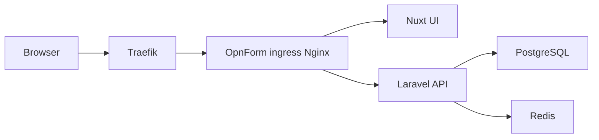

Use this guide when OpnForm should sit behind Traefik on your server. Traefik terminates TLS and forwards HTTPS traffic to OpnForm's internal Nginx ingress. Keep the rest of the official Docker Compose stack unchanged.

<Tip>
    If you are not using Traefik, follow the standard [Docker Deployment](/deployment/docker) guide instead.
</Tip>

## How the stack fits together

OpnForm already has an internal Nginx container (`ingress`) that routes `/api` to Laravel and everything else to the Nuxt UI. Traefik should publish that one service, not the API or UI containers individually.



## Prerequisites

- Docker and Docker Compose on the server
- A working Traefik instance, usually with a Docker network such as `traefik`
- A DNS record for your public hostname, for example `forms.example.com`, pointing at the Traefik host
- Traefik already handling HTTP-01 or TLS certificates for that hostname

## Step 1: Clone OpnForm

```bash
git clone https://github.com/OpnForm/OpnForm.git
cd OpnForm
```

Use the branch or tag you want to deploy. For a production image build from this repository, stay on the commit you intend to run.

## Step 2: Generate the application environment

```bash
chmod +x scripts/docker-setup.sh
./scripts/docker-setup.sh --public-url https://forms.example.com
```

Replace `https://forms.example.com` with the exact origin users type in the browser. Do not include a path or trailing slash. Use HTTPS.

The script writes `api/.env` and `client/.env`, including:

| File | Values |
| --- | --- |
| `api/.env` | `APP_URL` and `FRONT_URL` |
| `client/.env` | `NUXT_PUBLIC_APP_URL` and `NUXT_PUBLIC_API_BASE` |

## Step 3: Trust Traefik as a reverse proxy

Edit `api/.env` and set `TRUSTED_PROXIES` to the address or CIDR Traefik uses when it connects to the ingress container. This is usually the Traefik Docker network gateway or the Traefik container IP range.

```bash
TRUSTED_PROXIES=172.18.0.0/16
```

Use the network that Traefik and OpnForm share. Do not set `TRUSTED_PROXIES=*`. Recreate the API container after changing this value.

## Step 4: Attach the ingress to Traefik

The repository includes `docker-compose.traefik.yml`. It removes the published host port from `ingress` and adds Traefik labels.

Edit these values before starting:

- `forms.example.com` — your public hostname
- `websecure` — your Traefik HTTPS entrypoint name
- `letsencrypt` — your Traefik certificate resolver name
- `traefik` — the external Docker network Traefik uses

Then start OpnForm on that network:

```bash
docker compose -f docker-compose.yml -f docker-compose.traefik.yml up -d
```

If your Compose version does not honor `ports: !reset []`, comment out the `ports: - 80:80` mapping on `ingress` in `docker-compose.yml` so only Traefik is reachable from the internet.

## Step 5: Confirm the containers are healthy

```bash
docker compose ps
docker compose logs -f ingress api ui
```

Wait until `api`, `ui`, `api-scheduler`, `api-worker`, and `ingress` are healthy. The first start can take a few minutes while images pull.

The scheduler container (`api-scheduler`) must stay running. Abandoned drafts are marked every five minutes by `forms:mark-abandoned-submissions`.

Open `https://forms.example.com`. OpnForm should redirect to the setup page so you can create the admin account.

Then apply database migrations if you built from source or the API image does not run them automatically:

```bash
docker compose -f docker-compose.yml -f docker-compose.traefik.yml exec api php artisan migrate --force
```

## Step 6: Optional custom image build

The published Hub images do not include this incomplete-submission work until it is released. To deploy this checkout:

```bash
docker compose -f docker-compose.yml -f docker-compose.traefik.yml build
docker compose -f docker-compose.yml -f docker-compose.traefik.yml up -d
```

Or build specific images:

```bash
docker build -t opnform-api:local -f docker/Dockerfile.api .
docker build -t opnform-ui:local -f docker/Dockerfile.client .
```

The UI image is a full Nuxt production build. CSS minify warnings, large-chunk warnings, and Sentry "no auth token" messages are expected. A failure that ends with `signal SIGKILL` is the kernel out-of-memory killer, not those warnings.

The client Dockerfile now:

- Uses a 4 GB Node heap by default (raise only if the host has spare RAM)
- Skips source maps and the Sentry upload plugin
- Avoids a RAM-backed `/tmp` mount

If the UI build is still killed, add at least 8 GB of swap, then retry. On a 16 GB host you can raise the heap:

```bash
docker build --build-arg NODE_MAX_OLD_SPACE_SIZE=8192 -t opnform-ui:local -f docker/Dockerfile.client .
```

Create a `docker-compose.override.yml` so the API, worker, and scheduler all use the local API image:

```yaml
services:
  api:
    image: opnform-api:local
  api-worker:
    image: opnform-api:local
  api-scheduler:
    image: opnform-api:local
  ui:
    image: opnform-ui:local
```

Then start with:

```bash
docker compose -f docker-compose.yml -f docker-compose.traefik.yml -f docker-compose.override.yml up -d
```

## Traefik labels

The override file uses labels similar to:

```yaml
labels:
  - traefik.enable=true
  - traefik.docker.network=traefik
  - traefik.http.routers.opnform.rule=Host(`forms.example.com`)
  - traefik.http.routers.opnform.entrypoints=websecure
  - traefik.http.routers.opnform.tls=true
  - traefik.http.routers.opnform.tls.certresolver=letsencrypt
  - traefik.http.services.opnform.loadbalancer.server.port=80
```

Adjust entrypoint, resolver, and network names to match your Traefik deployment. The load balancer port is `80` because that is the ingress container's Nginx port, not the host port.

## Common Traefik issues

<AccordionGroup>
<Accordion title="Client image build killed with SIGKILL">
The Nuxt UI build needs several GB of RAM. `npm error signal SIGKILL` means Linux killed Node after it ran out of memory. CSS and chunk-size warnings in the same log are not the failure.

Pull the latest branch, then rebuild. The client Dockerfile defaults to a 4 GB heap and skips source maps. If it still dies, add swap:

```bash
sudo fallocate -l 8G /swapfile
sudo chmod 600 /swapfile
sudo mkswap /swapfile
sudo swapon /swapfile
```

On a host with 16 GB or more:

```bash
docker build --build-arg NODE_MAX_OLD_SPACE_SIZE=8192 -t opnform-ui:local -f docker/Dockerfile.client .
```
</Accordion>
<Accordion title="502 Bad Gateway">
Confirm `ingress` is on the same Docker network as Traefik and that the service port in the labels is `80`. Check `docker compose logs ingress`.
</Accordion>
<Accordion title="Redirect loop or mixed HTTP/HTTPS">
`APP_URL`, `FRONT_URL`, and `NUXT_PUBLIC_APP_URL` must be the public `https://` origin. Recreate the containers after changing `.env` files; `docker compose restart` does not reload them.
</Accordion>
<Accordion title="Wrong client IP or OIDC rate limits">
Set `TRUSTED_PROXIES` to the Traefik network CIDR, then recreate the API container. Leave it empty only if clients connect directly to the ingress.
</Accordion>
<Accordion title="Certificates not issued">
The Traefik router must use your TLS entrypoint and certificate resolver. The DNS record must point at the Traefik host, and port 443 must reach Traefik, not OpnForm.
</Accordion>
</AccordionGroup>

## Next steps

- [Environment variables](/configuration/environment-variables)
- [Email setup](/configuration/email-setup)
- [Partial and abandoned submissions](/features/partial-submissions)
