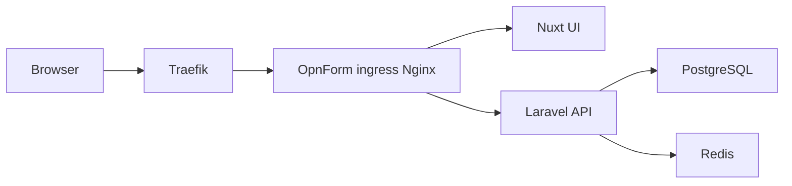

Use this guide when OpnForm should sit behind Traefik on your server. Traefik terminates TLS and forwards HTTPS traffic to OpnForm's internal Nginx ingress. Keep the rest of the official Docker Compose stack unchanged.

<Tip>
    If you are not using Traefik, follow the standard [Docker Deployment](/deployment/docker) guide instead.
</Tip>

## How the stack fits together

OpnForm already has an internal Nginx container (`ingress`) that routes `/api` to Laravel and everything else to the Nuxt UI. Traefik should publish that one service, not the API or UI containers individually.



## Prerequisites

- Docker and Docker Compose on the server
- A working Traefik instance, usually with a Docker network such as `traefik`
- A DNS record for your public hostname, for example `forms.example.com`, pointing at the Traefik host
- Traefik already handling HTTP-01 or TLS certificates for that hostname

## Clean checkout

Do not copy Traefik labels into `docker-compose.yml` or `docker-compose.override.yml`. Those files must not define `ingress` without `image: nginx:1`.

```bash
git fetch origin
git checkout cursor/partial-submission-webhook-8dbe
git pull origin cursor/partial-submission-webhook-8dbe
```

Replace a broken override file if you created one earlier:

```bash
cp docker-compose.override.example.yml docker-compose.override.yml
```

## Step 1: Generate the application environment

```bash
chmod +x scripts/docker-setup.sh scripts/docker-compose-traefik.sh
./scripts/docker-setup.sh --traefik --public-url https://forms.example.com
```

Replace `https://forms.example.com` with the exact origin users type in the browser. Do not include a path or trailing slash. Use HTTPS.

The script writes:

| File | Values |
| --- | --- |
| `api/.env` | `APP_URL` and `FRONT_URL` |
| `client/.env` | `NUXT_PUBLIC_APP_URL` and `NUXT_PUBLIC_API_BASE` |
| `docker/traefik.env` | `OPNFORM_DOMAIN` taken from that URL |

## Step 2: Trust Traefik as a reverse proxy

Edit `api/.env` and set `TRUSTED_PROXIES` to the address or CIDR Traefik uses when it connects to the ingress container. This is usually the Traefik Docker network gateway or the Traefik container IP range.

```bash
TRUSTED_PROXIES=172.18.0.0/16
```

Use the network that Traefik and OpnForm share. Do not set `TRUSTED_PROXIES=*`. Recreate the API container after changing this value.

## Step 3: Review Traefik settings

Edit `docker/traefik.env` if the hostname, entrypoint, certificate resolver, or Docker network name differ:

```bash
OPNFORM_DOMAIN=forms.example.com
TRAEFIK_ENTRYPOINT=websecure
TRAEFIK_CERT_RESOLVER=letsencrypt
TRAEFIK_DOCKER_NETWORK=traefik
OPNFORM_INGRESS_IP=127.0.0.1
OPNFORM_INGRESS_PORT=18080
```

`OPNFORM_INGRESS_PORT` must not be `80`. Traefik binds 80/443 on the host. Ingress stays reachable from Traefik on the Docker network at container port 80.

## Step 4: Validate Compose, then start

```bash
./scripts/docker-compose-traefik.sh config
./scripts/docker-compose-traefik.sh up -d
```

`config` must print `image: nginx:1` under `ingress`. The helper loads, in this order:

1. `docker/traefik.env`
2. `docker-compose.yml`
3. `docker-compose.traefik.yml`
4. `docker-compose.override.yml` if present

It refuses to start if the override file defines `ingress`.

## Step 5: Confirm the containers are healthy

```bash
./scripts/docker-compose-traefik.sh ps
./scripts/docker-compose-traefik.sh logs -f ingress api ui
```

Wait until `api`, `ui`, `api-scheduler`, `api-worker`, and `ingress` are healthy. The first start can take a few minutes while images pull.

The scheduler container (`api-scheduler`) must stay running. Abandoned drafts are marked every five minutes by `forms:mark-abandoned-submissions`.

Open `https://forms.example.com`. OpnForm should redirect to the setup page so you can create the admin account.

Then apply database migrations if you built from source or the API image does not run them automatically:

```bash
./scripts/docker-compose-traefik.sh exec api php artisan migrate --force
```

## Step 6: Optional custom image build

The published Hub images do not include this incomplete-submission work until it is released. Build from this checkout:

```bash
docker build -t opnform-api:local -f docker/Dockerfile.api .
docker build -t opnform-ui:local -f docker/Dockerfile.client .
```

The UI image is a full Nuxt production build. CSS minify warnings, large-chunk warnings, and Sentry "no auth token" messages are expected. A failure that ends with `signal SIGKILL` is the kernel out-of-memory killer, not those warnings.

The client Dockerfile now:

- Uses a 4 GB Node heap by default (raise only if the host has spare RAM)
- Skips source maps and the Sentry upload plugin
- Avoids a RAM-backed `/tmp` mount

If the UI build is still killed, add at least 8 GB of swap, then retry. On a 16 GB host you can raise the heap:

```bash
docker build --build-arg NODE_MAX_OLD_SPACE_SIZE=8192 -t opnform-ui:local -f docker/Dockerfile.client .
```

Copy the example override so the API, worker, and scheduler all use the local API image:

```bash
cp docker-compose.override.example.yml docker-compose.override.yml
./scripts/docker-compose-traefik.sh up -d
```

## Traefik labels

`docker-compose.traefik.yml` always sets `image: nginx:1` and labels similar to:

```yaml
labels:
  - traefik.enable=true
  - traefik.docker.network=traefik
  - traefik.http.routers.opnform.rule=Host(`forms.example.com`)
  - traefik.http.routers.opnform.entrypoints=websecure
  - traefik.http.routers.opnform.tls=true
  - traefik.http.routers.opnform.tls.certresolver=letsencrypt
  - traefik.http.services.opnform.loadbalancer.server.port=80
```

The hostname comes from `OPNFORM_DOMAIN`. The load balancer port is `80` because that is the ingress container's Nginx port, not the host port.

## Common Traefik issues

<AccordionGroup>
<Accordion title="Client image build killed with SIGKILL">
The Nuxt UI build needs several GB of RAM. `npm error signal SIGKILL` means Linux killed Node after it ran out of memory. CSS and chunk-size warnings in the same log are not the failure.

Pull the latest branch, then rebuild. The client Dockerfile defaults to a 4 GB heap and skips source maps. If it still dies, add swap:

```bash
sudo fallocate -l 8G /swapfile
sudo chmod 600 /swapfile
sudo mkswap /swapfile
sudo swapon /swapfile
```

On a host with 16 GB or more:

```bash
docker build --build-arg NODE_MAX_OLD_SPACE_SIZE=8192 -t opnform-ui:local -f docker/Dockerfile.client .
```
</Accordion>
<Accordion title="service ingress has neither an image nor a build context">
The Traefik labels belong only in `docker-compose.traefik.yml`, which includes `image: nginx:1`. If `docker-compose.override.yml` or `docker-compose.yml` contains an `ingress:` block with only labels, Compose drops nginx.

```bash
grep -n ingress docker-compose.yml docker-compose.traefik.yml docker-compose.override.yml
cp docker-compose.override.example.yml docker-compose.override.yml
./scripts/docker-compose-traefik.sh config
```
</Accordion>
<Accordion title="network traefik declared as external, but could not be found">
The Compose file is valid. Docker has no network named `traefik`. Find the network your Traefik container already uses:

```bash
docker network ls
docker ps --format '{{.Names}}\t{{.Image}}' | grep -i traefik
docker inspect "$(docker ps -qf name=traefik)" --format '{{range $k, $v := .NetworkSettings.Networks}}{{$k}}{{"\n"}}{{end}}'
```

Put that exact network name in `docker/traefik.env`:

```bash
TRAEFIK_DOCKER_NETWORK=proxy
```

Then run `./scripts/docker-compose-traefik.sh up -d` again. Creating a new empty `traefik` network does not help unless the Traefik container is attached to it.
</Accordion>
<Accordion title="502 Bad Gateway">
Confirm `ingress` is on the same Docker network as Traefik and that the service port in the labels is `80`. Check `./scripts/docker-compose-traefik.sh logs ingress`.
</Accordion>
<Accordion title="Redirect loop or mixed HTTP/HTTPS">
`APP_URL`, `FRONT_URL`, and `NUXT_PUBLIC_APP_URL` must be the public `https://` origin. Recreate the containers after changing `.env` files; `docker compose restart` does not reload them.
</Accordion>
<Accordion title="Wrong client IP or OIDC rate limits">
Set `TRUSTED_PROXIES` to the Traefik network CIDR, then recreate the API container. Leave it empty only if clients connect directly to the ingress.
</Accordion>
<Accordion title="Certificates not issued">
The Traefik router must use your TLS entrypoint and certificate resolver. The DNS record must point at the Traefik host, and port 443 must reach Traefik, not OpnForm.
</Accordion>
<Accordion title="Incomplete Submission Webhook is greyed out">
Self-hosted Community has no Business plan. The running UI image still treats that card as a Cloud upgrade. Pull this branch, rebuild **both** images, and recreate the UI container:

```bash
git pull
docker build -t opnform-api:local -f docker/Dockerfile.api .
docker build -t opnform-ui:local -f docker/Dockerfile.client .
./scripts/docker-compose-traefik.sh up -d --force-recreate api ui
```

Hard-refresh the browser after the new UI container is up. Restarting the old `opnform-ui:local` image is not enough.
</Accordion>
<Accordion title="Workspace Email Settings ask for an Enterprise license">
Self-hosted Community can save workspace SMTP without a license. Pull this branch, rebuild **both** images, and recreate the API and UI containers:

```bash
git pull
docker build -t opnform-api:local -f docker/Dockerfile.api .
docker build -t opnform-ui:local -f docker/Dockerfile.client .
./scripts/docker-compose-traefik.sh up -d --force-recreate api api-worker api-scheduler ui
```

Then open workspace **Email Settings**, enter SMTP details, and add an Email Notification on a form. Keep instance-wide `MAIL_*` configured if you also want account emails such as password resets.
</Accordion>
</AccordionGroup>

## Next steps

- [Environment variables](/configuration/environment-variables)
- [Email setup](/configuration/email-setup)
- [Partial and abandoned submissions](/features/partial-submissions)
