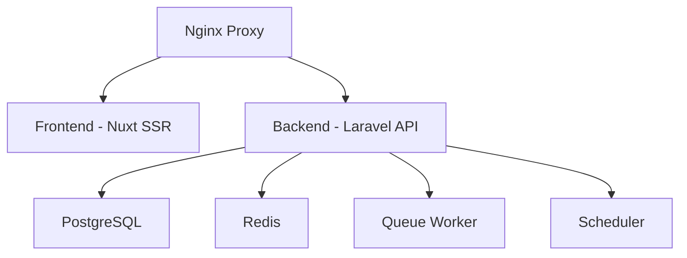

import CloudVersion from "/snippets/cloud-version.mdx";

<CloudVersion />

<Tip>
    Looking to develop OpnForm locally? Check out our [Docker Development
    Setup](/deployment/docker-development) guide which provides hot-reload and
    other development features.
</Tip>

## Quick Start

1. Clone the repository:
    ```bash
    git clone https://github.com/OpnForm/OpnForm.git
    cd OpnForm
    ```

<Warning>
    **Important for Windows Users**: Ensure script files maintain LF
    (Unix-style) line endings. If you're using Windows, configure Git to
    preserve line endings: ```bash git config core.autocrlf false ``` And
    check/fix the artisan script before running setup: ```bash # Using Git Bash
    or WSL dos2unix api/artisan ``` Otherwise, Docker containers may hang at
    "Waiting for DB to be ready" during startup.
</Warning>

2. Run the setup script:

    ```bash
    chmod +x scripts/docker-setup.sh
    ./scripts/docker-setup.sh --public-url https://forms.example.com
    ```

    Replace `https://forms.example.com` with the origin that users enter in
    their browser. Do not include a path or trailing slash. Use HTTPS for a
    production deployment.

    The script will:

    - Create necessary environment files
    - Configure the public backend and frontend URLs
    - Pull required Docker images
    - Start all containers in production mode
    - Display access information

3. Access your OpnForm instance at the public URL you provided.

<Note>
    To evaluate OpnForm only on the local machine, omit `--public-url` and open
    `http://localhost`. The script warns when the generated configuration still
    points to localhost.
</Note>

### Configure your public instance URL

Pass the public origin to the setup script to configure all required values in
one command. You can run the same command again to update an existing
installation; existing application keys and secrets are preserved.

```bash
./scripts/docker-setup.sh --public-url https://forms.example.com
```

The command sets these values:

| File | Required variables |
| --- | --- |
| `api/.env` | `APP_URL` and `FRONT_URL` |
| `client/.env` | `NUXT_PUBLIC_APP_URL` and `NUXT_PUBLIC_API_BASE` |

An instance available at `https://forms.example.com` uses that origin for
`APP_URL`, `FRONT_URL`, and `NUXT_PUBLIC_APP_URL`, plus
`https://forms.example.com/api` for `NUXT_PUBLIC_API_BASE`.

If you edit either `.env` file manually, recreate the containers; `docker
compose restart` does not load new environment values.

```bash
docker compose down
docker compose up -d
```

See [Public instance URL](/configuration/environment-variables#public-instance-url-self-hosted)
for the complete example and [OIDC SSO Configuration](/configuration/oidc-sso#prerequisites)
before setting up SSO.

### If a reverse proxy is in front of OpnForm

When Caddy, Traefik, Cloudflare, or another reverse proxy forwards traffic to
the Docker ingress, set `TRUSTED_PROXIES` in `api/.env` to the IP address or
CIDR range from which that proxy connects to the ingress. This lets OpnForm use
the real client IP for OIDC and other rate limits.

```bash
# Example only: use the actual address or CIDR of your own reverse proxy.
TRUSTED_PROXIES=192.0.2.10,2001:db8:1234::/48
```

Leave it empty when users connect directly to the Docker ingress. Do not set
it to `*`: doing so would make a direct client-provided forwarding header
trustworthy and allow rate-limit bypasses. Recreate the API container after
changing it.

For a full Traefik walkthrough, including labels, Docker networks, and TLS,
see [Docker with Traefik](/deployment/docker-traefik).

### Initial Setup

After deployment, OpnForm will automatically redirect you to a setup page where you can create your admin account. Simply visit `http://localhost` and you'll be guided through the setup process.

<Note>
    Public registration is disabled in the self-hosted version after setup is
    complete. Use the admin account to invite additional users. Free
    self-hosted instances are limited to 2 users total across the instance;
    activate a self-hosted Enterprise license to add more users.
</Note>

<Info>
    A self-hosted Enterprise license is optional. Core self-hosted OpnForm works
    without a license, including OIDC within the free 2-user limit. Adding more
    users and advanced Enterprise features require license activation. See
    [Self-hosted License](/deployment/self-hosted-license).
</Info>

## Architecture



### Components

<Tabs>
    <Tab title="Frontend">
        The Nuxt frontend service: - Server-Side Rendered application - Built
        with Vue 3 and Tailwind CSS - Handles dynamic rendering and client-side
        interactivity - Optimized for production performance
    </Tab>
    <Tab title="Backend">
        The Laravel API service: - Handles business logic and data persistence -
        Provides REST API endpoints - Manages file uploads and processing -
        Includes required PHP extensions (pgsql, redis, etc.) - Configured for
        PostgreSQL and Redis connections
    </Tab>
    <Tab title="Workers">
        Background processing services: - **API Worker**: Processes queued jobs
        (emails, exports, etc.) - **API Scheduler**: Handles scheduled tasks and
        periodic cleanups - Both share the same codebase as the main API
    </Tab>
    <Tab title="Databases">
        Data storage services: - **PostgreSQL**: Primary database for all
        application data - **Redis**: Used for: - Session storage - Cache -
        Queue management - Real-time features
    </Tab>
    <Tab title="Proxy">
        The Nginx proxy service: - Routes requests between frontend and backend
        - Handles SSL termination - Manages file upload limits - Serves static
        assets - Configured for optimal performance
    </Tab>
</Tabs>

## Docker Images

OpnForm provides pre-built Docker images for easy deployment:

-   [OpnForm API Image](https://hub.docker.com/r/jhumanj/opnform-api)
-   [OpnForm Client Image](https://hub.docker.com/r/jhumanj/opnform-client)

### Building Custom Images

While we recommend using the official images, you can build custom images if needed:

```bash
# Build all images
docker compose build

# Or build specific images
docker build -t opnform-api:local -f docker/Dockerfile.api .
docker build -t opnform-ui:local -f docker/Dockerfile.client .
```

The UI build can take several minutes and several GB of RAM. Warnings about CSS minification, chunk size, and missing Sentry tokens are normal. If the build exits with `signal SIGKILL`, the host ran out of memory; see [Docker with Traefik](/deployment/docker-traefik#common-traefik-issues).

### Custom Configuration

Create a `docker-compose.override.yml` to customize your deployment:

```yaml
services:
    api:
        image: opnform-api:local
        environment:
            PHP_MEMORY_LIMIT: 1G
    ui:
        image: opnform-ui:local
    ingress:
        volumes:
            - ./custom-nginx.conf:/etc/nginx/conf.d/default.conf
```

## Environment Variables

For detailed information about environment variables and how to update them in Docker, see our [Environment Variables](/configuration/environment-variables#docker-environment-variables) documentation.

## Maintenance

### Updates

1. Pull latest changes:

    ```bash
    git pull origin main
    ```

2. Update containers:
    ```bash
    docker compose pull
    docker compose up -d
    ```

### Monitoring

View container logs:

```bash
# All containers
docker compose logs -f

# Specific container
docker compose logs -f api
```

Monitor container health:

```bash
docker compose ps
```

## Troubleshooting

### Container Issues

If containers aren't starting:

```bash
# View detailed logs
docker compose logs -f

# Recreate containers
docker compose down
docker compose up -d
```

### Database Issues

If database connections fail:

```bash
# Check database status
docker compose exec db pg_isready

# View database logs
docker compose logs db
```

If the API container is stuck on "Waiting for DB to be ready":

```bash
# Check for line ending issues in the artisan script
# The file should use LF (Unix) line endings, not CRLF (Windows)

# Fix line endings on Unix/Mac:
sed -i 's/\r$//' api/artisan

# Fix line endings on Windows (using Git Bash or WSL):
dos2unix api/artisan
```

<Note>
    **Line Ending Issue**: When using Git or code editors on Windows, line
    endings in the `artisan` script may be converted from LF (Unix-style) to
    CRLF (Windows-style). This prevents the Docker container from properly
    executing the script, causing it to hang at "Waiting for DB to be ready".
    Always ensure script files maintain LF line endings.
</Note>

### Cache Issues

Clear various caches:

```bash
# Clear application cache
docker compose exec api php artisan cache:clear

# Clear config cache
docker compose exec api php artisan config:clear

# Clear route cache
docker compose exec api php artisan route:clear
```

### Permission Issues

Fix storage permissions:

```bash
docker compose exec api chown -R www-data:www-data storage
docker compose exec api chmod -R 775 storage
```

### Synology Container Manager

When deploying through Synology Container Manager, set the project **Path** to
the cloned OpnForm directory instead of uploading `docker-compose.yml` by
itself. The Compose file also references the generated `api/.env` and
`client/.env` files, as well as `docker/nginx.conf`, using paths relative to the
project directory. Keep this directory structure intact:

```text
OpnForm/
├── docker-compose.yml
├── api/
│   └── .env
├── client/
│   └── .env
└── docker/
    └── nginx.conf
```

Make sure `docker/nginx.conf` exists as a file before starting the project and
is mounted to `/etc/nginx/templates/default.conf.template`. Mounting the
containing directory instead can leave the ingress container with the default
Nginx configuration. If port 80 is already in use on the NAS, change the
ingress port mapping from `80:80` to another host port, such as `8800:80`.

See [GitHub issue #1005](https://github.com/OpnForm/OpnForm/issues/1005) for a
working Synology Container Manager configuration and its troubleshooting
history.
